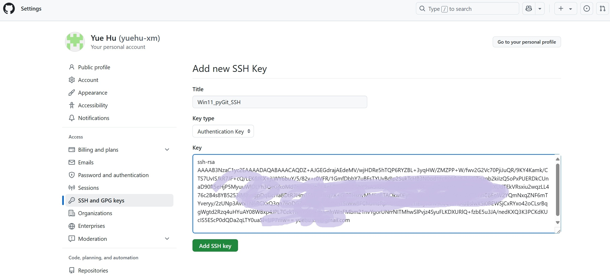

# Git 操作记录

## 1. Windows 11 下的 Git 使用案例

### <mark>1.1. 配置Git全局用户信息（关联本地账号）【git config】</mark>

```bash
# 设置用户名（需与GitHub账号一致）
git config --global user.name "yuehu-xm"

# 设置邮箱（需与GitHub注册邮箱一致）
git config --global user.email "yuehu.xm@gmail.com"
```

**运行效果：**

- 在 `C:\Users\<用户名>\.gitconfig` 文件中生成配置（无需手动查看）。

|  |
|:--------------------------------:|
|  |
|  |

### <mark>1.2. 排除无关文件【`.gitignore`】</mark>

方式 1：用 PyCharm 右键项目 → New → File → 输入 .gitignore

方式 2：直接在 Git Bash 中执行：

```bash
echo ".idea/" >> .gitignore   # 忽略 PyCharm 配置
echo "__pycache__/" >> .gitignore  # 忽略 Python 缓存
echo "venv/" >> .gitignore   # 忽略虚拟环境

echo "paper/" >> .gitignore   # 忽略文章
```

|  |
|:--------------------------------:|
|  |

```gitignore

# === Python项目 ===
paper/

# === Python开发核心规则 ===
__pycache__/
*.py[cod]  # 包含.pyc/.pyo/.pyd
*.so
*.egg-info/
dist/
build/
*.log      # 日志文件
*.tmp      # 临时文件

# === 系统级文件 ===
# Windows
Thumbs.db
Desktop.ini
*.lnk
# macOS
.DS_Store
# Linux临时文件
*.swp
*.swo

# === IDE配置 ===
.idea/
.vscode/
.vscode-server/
*.code-workspace
```

### <mark>1.3. 初始化仓库【`git init`】</mark>

```bash
git init          # 初始化仓库
```

|  |
|:--------------------------------:|
|  |
|  |

**运行效果：**

- 生成隐藏文件夹 `.git`（项目根目录下）。
- 在 PyCharm 中，项目文件夹颜色变为红色（表示未跟踪）。

**红色文件夹**通常表示以下两种情况：

1. **未跟踪的文件**（Untracked Files）：

   新增的文件尚未被 Git 纳入版本控制（从未执行过 git add）。
2. **已修改但未暂存的文件**（Changes not staged for commit）：

   文件已被 Git 跟踪，但修改后未通过 git add 添加到暂存区。

### <mark>1.4. 暂存区添加内容【`git add`】</mark>

**（1）添加所有文件（包含子目录）**

```bash
git add .                        # 将所有文件添加到暂存区
```

**（2）添加指定文件**

```bash
git add README.md                # 将文件添加到暂存区
```

**（3）提交特定类型的文件**

```bash
git add *.py                     # 将所有.py文件添加到暂存区
git add img/*.png                # 添加 img 目录下所有 .png 文件
```

**（4）PyCharm 可视化操作**

`右键文件 → Git → Add to VCS（等同于 git add）。`

文件颜色变为 绿色（已暂存）

`git add .` 的**作用是** 将当前目录（包括子目录）下所有变动的文件添加到暂存区，具体包括：

- 新增的未跟踪文件 （如图中的 img/微信截图*.png）。
- 已跟踪但修改后的文件 （如 paper/main.py 的内容变更）。
- 已跟踪但未删除的文件 （需配合 git rm 才会标记删除）。

`git add .` 的**生效逻辑**：

- 首次执行 `git add .` 时，会提交 `.gitignore` 文件本身，并 立即应用文件中的忽略规则。
- 后续操作中，`.gitignore` 规则持续生效。

**运行效果：**

- 文件颜色从红色（未跟踪）变为绿色（已提交）。
- 右键项目 → Git → Show History 可查看提交记录。

|  |
|:--------------------------------:|

出现 `LF will be replaced by CRLF` 警告的原因是 Git 的换行符自动转换功能被触发：

- `LF（Line Feed）`：Linux/macOS 系统的换行符。
- `CRLF（Carriage Return + Line Feed）`：Windows 系统的换行符。

当 Git 检测到文件在 Windows 中被编辑（使用 CRLF），但仓库默认使用 LF 时，会触发自动转换并生成此警告。

### <mark>1.4.1. 跨平台换行符规范配置【`git conig`】</mark>

1. 核心设置策略
```bash
# Windows开发者必须执行（PowerShell）
git config --global core.autocrlf true     # 提交转LF，检出转CRLF
git config --global core.safecrlf warn    # 混合换行符时警告

# Linux/macOS开发者必须执行
git config --global core.autocrlf input   # 提交转LF，检出不转换
git config --global core.eol lf           # 强制使用LF换行符
```


**重置暂存区并修复规则**

```bash
# 清除所有暂存（保留本地文件）
git reset HEAD -- .

# 强制应用最新.gitignore规则
git rm -r --cached .
git add .
```

**清除历史跟踪记录**

```bash
# 停止跟踪已暂存的 .idea/ 文件（保留本地文件）
git rm -r --cached .idea/

# 强制重新应用所有忽略规则
git rm -r --cached .  # 清除所有缓存
git add .             # 重新添加文件（此时忽略规则生效）
git commit -m "fix: 彻底忽略 .idea/ 目录"
```

### <mark>1.5. 掌握仓库状态检查工具【`git status`】</mark>

```bash
git status  # 显示工作区与暂存区状态
```

**主要用途：**

- 查看 **未跟踪文件**（Untracked files，红色显示）。
- 查看 **已修改但未暂存的文件**（Changes not staged，红色显示）。
- 查看 **已暂存待提交的文件**（Changes to be committed，绿色显示）。

|  |
|:------------------------------------:|

```bash
git status --ignored
```

**主要用途：**

- 列出所有被 .gitignore 规则排除的文件。
- 验证忽略规则是否生效，避免意外文件泄露。

### <mark>1.6. 提交暂存区内容【`git commit`】</mark>

```bash
git commit -m "第一次提交"
```

### <mark>1.7. 生成SSH密钥（用于安全通信）</mark>

```bash
ssh-keygen -t rsa -b 4096 -C "your_email@example.com"
# 密钥默认保存在：C:\Users\YourUsername\.ssh\
```

**关键操作提示：**

**1. 路径选择**

- 当提示 `Enter file in which to save the key` 时：
    - 默认路径：直接回车，使用 C:\Users\YourUsername\.ssh\id_rsa（适用于单账号场景）
    - 自定义路径：输入如 E:\Workspace\my_project_rsa（适用于多项目隔离场景），若路径含空格需加引号（如 "D:\My
      Projects\.ssh\key"）

**2. 密码设置**

- 输入 `Enter passphrase` 时建议设置12位以上混合密码（如 PyProject@2025），提升私钥安全性

**3. 生成结果验证**

3.1. 打开.ssh目录

- 在地址栏输入：%USERPROFILE%\.ssh（自动跳转当前用户目录）
- 或手动导航至：C:\Users\[你的用户名]\.ssh

3.2. 显示隐藏文件

- 若目录不可见，需开启显示隐藏文件：
- 文件资源管理器 → 查看 → 显示 → 勾选"隐藏的项目"

3.3. 检查文件列表

- 确认存在以下两个文件：
    - id_rsa（私钥，图标为无关联程序）
    - id_rsa.pub（公钥，可用记事本打开）

|  |
|:--------------------------------:|
|  |

### <mark>1.8. 添加公钥到GitHub</mark>

**1. 复制公钥内容**

- 手动查看方式：用记事本打开 id_rsa.pub 文件，内容以 ssh-rsa AAAAB3... 开头

**2. GitHub配置路径**

- 登录GitHub → **Settings** → **SSH and GPG Keys** → **New SSH Key**
- **Title** 填写设备标识（如 Win11_pyGit_SSH）
- **Key type** 保持默认 Authentication Key
- **Key** 粘贴剪贴板内容（确保无换行或多余空格）

|  |
|:--------------------------------:|
|  |

### <mark>1.9. 关联远程仓库</mark>

**1. 获取远程仓库SSH地址**

- 在GitHub仓库页面点击 Code → SSH → 复制 `git@github.com:yuehu-xm/pyGit.git`

|  |
|:--------------------------------:|

**2. 本地仓库绑定远程**

```bash
# 关联远程仓库（origin为默认别名，可自定义如github-prod）
git remote add origin git@github.com:yuehu-xm/pyGit.git
```

验证关联状态：

```bash
git remote -v # 应显示fetch/push地址
```

|  |
|:--------------------------------:|

### <mark>1.10. 推送远程仓库【Git push】</mark>

```bash
# 推送本地main分支到远程（-u参数绑定默认上游分支）
git push -u origin main
```

|  |
|:--------------------------------:|
|  |

**连接测试与排错**

```bash
# 测试SSH连通性
ssh -T git@github.com
```


## 1. Github 上 Python项目多人协作维护指南

## 3. Git 操作指令

| 序号 | 指令                                                                                                       | 说明                     |
|----|----------------------------------------------------------------------------------------------------------|------------------------|
| 1  | `git init`                                                                                               | 初始化一个新仓库               |
| 2  | `git clone <远程仓库地址>`                                                                                     | 克隆远程仓库到本地              |
| 3  | `git config --global user.name "Your Name"`<br>`git config --global user.email "your.email@example.com"` | 配置全局用户名和邮箱             |
| 4  | `git status`                                                                                             | 查看项目当前状态（修改/未跟踪文件）     |
| 5  | `git add <文件名>`                                                                                          | 将指定文件添加到暂存区            |
| 6  | `git commit -m "提交描述"`                                                                                   | 提交暂存区内容并添加描述信息         |
| 7  | `git log`                                                                                                | 查看提交历史记录               |
| 8  | `git branch <分支名>`                                                                                       | 创建新分支                  |
| 9  | `git checkout <分支名>`                                                                                     | 切换到指定分支                |
| 10 | `git merge <被合并的分支名>`                                                                                    | 将指定分支合并到当前分支           |
| 11 | `git remote -v`                                                                                          | 查看远程仓库地址信息             |
| 12 | `git pull origin <分支名>`                                                                                  | 拉取远程仓库最新变更到本地          |
| 13 | `git clone <远程仓库地址> -b <分支名>`                                                                            | 克隆远程仓库并直接切换到指定分支       |
| 14 | `手动解决冲突`                                                                                                 | 合并冲突时需手动编辑冲突文件，完成后重新提交 |
| 15 | `git tag -a <标签名> -m "标签描述" <提交哈希>`                                                                      | 为指定提交创建带有描述的标签         |
| 16 | `git branch -r`                                                                                          | 查看远程分支列表               |
| 17 | `git checkout <版本号> -- <文件名>`                                                                            | 将指定文件恢复为某个历史版本         |
| 18 | `git branch new-branch`<br>`git checkout new-branch`                                                     | 创建新分支并立即切换到该分支         |
| 19 | `git push origin branch-name`                                                                            | 将本地分支推送到远程仓库           |